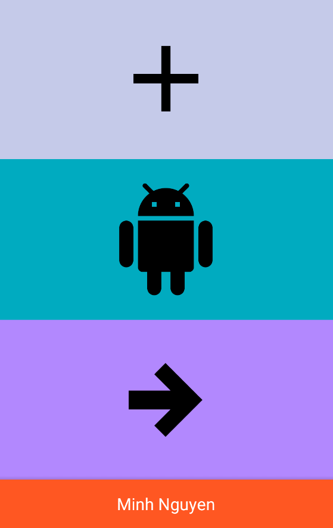

# AnimationVectorDrawable

Author: **Minh Nguyen**

Time spent: 5 hours spent in total

## User Stories
Design and implement AVD 
* [x] Design AVD with SVG
* [x] AVD implementation

## Walkthrough
  
